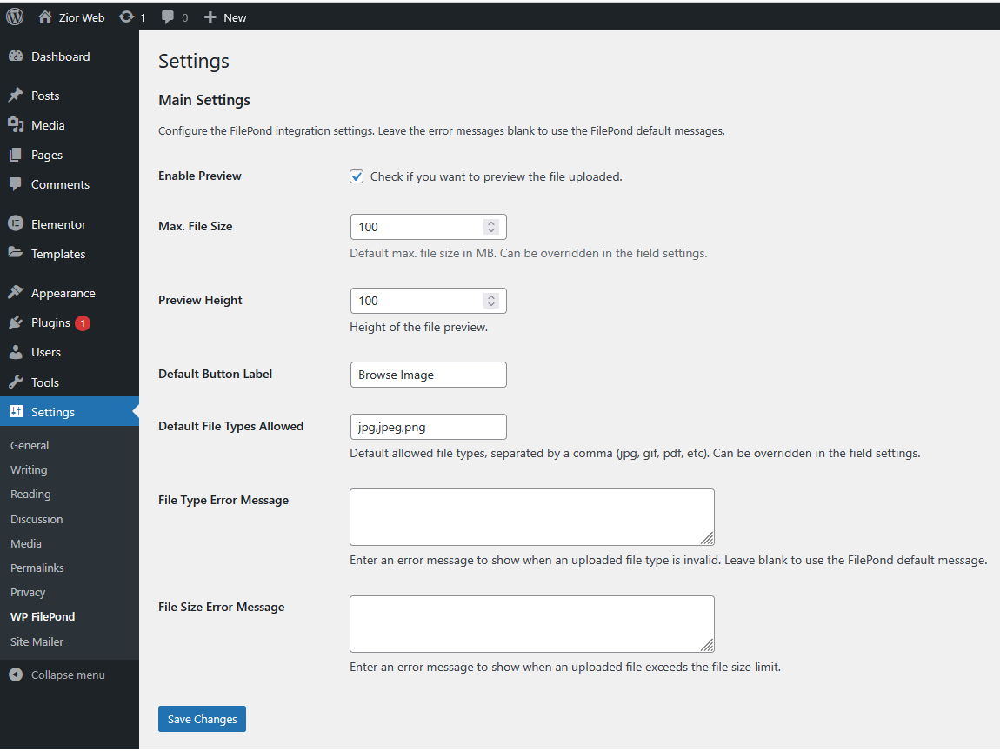
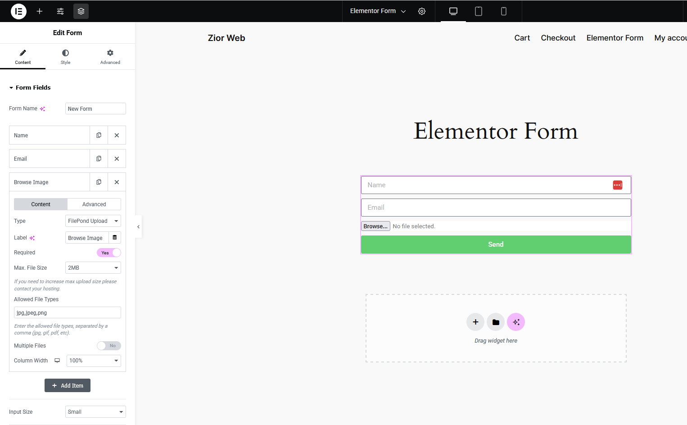

# FilePond WP Integration 

**FilePond WP Integration** is a WordPress plugin that integrates [FilePond](https://pqina.nl/filepond/) with Elementor Pro Forms, allowing seamless file uploads with advanced features like image previews, drag-and-drop, and asynchronous uploads.

## Features

**Seamless Integration** – Adds a FilePond uploader field to Elementor Pro Forms  
**Asynchronous Uploads** – Upload files in the background without page reloads  
**Drag & Drop Support** – Easily upload files by dragging them into the field  
**Customizable Settings** – Configure file size, allowed types, and more  
**Secure Upload Handling** – Uses WordPress file handling best practices  

## Installation

1. **Download & Upload:**  
   - Download the plugin ZIP from GitHub or the WordPress plugin directory.
   - Upload it to your WordPress site via **Plugins → Add New → Upload Plugin**.

2. **Activate the Plugin:**  
   - Go to **Plugins** in the WordPress admin panel.
   - Find **FilePond WP Integration** and click **Activate**.

3. **Configure Settings:**  
   - Navigate to **Settings → FilePond WP Integration** to configure upload options.

## Usage

1. **Add FilePond Field in Elementor:**  
   - Edit your Elementor form and add a new **FilePond Upload** field.
   - Configure the field settings as needed.

2. **Handle File Uploads:**  
   - Uploaded files are stored securely and can be accessed via the WordPress Media Library.

## Screenshots

### Plugin Settings Page  

### FilePond Upload Field in Elementor Form  

### Elementor Form Builder with FilePond Upload Field  

## Frequently Asked Questions

### Q: Does this work without Elementor Pro?  
**A:** No, Elementor Pro is required since the FilePond field is integrated into its form module.

### Q: Where are the uploaded files stored?  
**A:** Files are stored in the WordPress Media Library or a custom directory, based on your settings.

### Q: Can I restrict allowed file types?  
**A:** Yes, you can configure allowed file types in the **plugin settings**.

## Contributing

We welcome contributions! Feel free to fork this repository and submit a pull request.

## License

This plugin is licensed under the **GPL-2.0-or-later** license.

---

Developed by **ZiorWeb.Dev**
